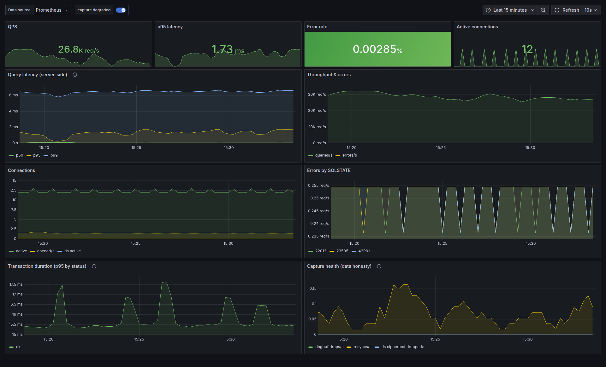

# latkit

**Per-query PostgreSQL latency without extension, config change, and database restart.**

Latkit is an eBPF agent that watches the PostgreSQL wire protocol at the
socket layer and turns it into per-query latency histograms: normalised query
text, database/user labels, row counts, SQLSTATE errors, transaction timings.
It exports to Prometheus and OpenTelemetry, ships with four ready-made Grafana
dashboards, runs beside the database, and the database never knows it's there.




## Try the demo (≈2 minutes)

One command brings up the whole stack: PostgreSQL + a load generator + latkit +
Prometheus + Grafana with every dashboard provisioned. All you need is a
Linux host with Docker and a BTF-enabled kernel ≥ 5.15 (any mainstream distro
of the last few years):

```sh
git clone --recurse-submodules https://github.com/sky-rzn/latkit.git
cd latkit/deploy/demo
docker compose up --build -d
```

Open <http://localhost:3000/dashboards> and start with **latkit - Overview**;
live query latency shows up within a minute. TLS profile and troubleshooting:
[deploy/demo/README.md](deploy/demo/README.md).

## Why latkit

- **Zero-touch.** You don't need PostgreSQL extension, `shared_preload_libraries`
  or restart. Point the agent at a running database and metrics start flowing.
  Nothing runs inside PostgreSQL. The database doesn't know the agent exists.
- **Server-side truth.** Latency is measured network-to-network on the DB
  host. It's what the server actually took, per query, including everything
  `pg_stat_statements` never sees (parse, protocol round-trips, result
  streaming). See [the measurement model](#what-the-numbers-mean).
- **Bounded cardinality by construction.** SQL is normalised to a fingerprint
  (literals → `?`), a top-K LRU caps the distinct `query` labels, and the rest
  folds into `query="other"`.
- **Honest under loss.** Ringbuf drops and parser resyncs are counted and
  dashboarded.
- **TLS without decryption keys.** Encrypted sessions ride the same pipeline
  via `libssl` uprobes. You don't need to pass private keys.
- **Drops in anywhere.** One static binary (musl, ~4 MB), Docker image,
  systemd unit or k8s DaemonSet.

## Installation

You can install latkit using one of the following methods.

### Release binary

Grab the tarball from the GitHub Releases page (statically linked, x86_64;
runs on any distro - the only dependency is the kernel, see
[Requirements](#requirements)):

```sh
sha256sum -c SHA256SUMS                # both files come with the release
tar xf latkit-vX.Y.Z-linux-x86_64.tar.gz && cd latkit-vX.Y.Z-linux-x86_64
sudo ./latkit                          # captures local port 5432
curl -s localhost:9752/metrics | head
```

The tarball also carries the Grafana dashboards, the systemd unit and the
k8s DaemonSet from this repository.

### Docker

The image is `FROM scratch` + the static binary (≈4 MB), published to
ghcr.io on releases (`ghcr.io/sky-rzn/latkit:vX.Y.Z`, `:latest`), or built
locally: `docker build -f deploy/docker/Dockerfile -t latkit .`

```sh
docker run -d --pid=host \
    --cap-add BPF --cap-add PERFMON \
    -e LATKIT_PROM_LISTEN=0.0.0.0:9752 -p 9752:9752 latkit
```

For TLS capture add `-e LATKIT_TLS=auto --cap-add SYS_PTRACE --cap-add
SYS_ADMIN` (see [Requirements](#requirements) for why). `--privileged` is
the documented fallback when a runtime or LSM cannot express the
fine-grained set - diagnosis recipes in [docs/deploy.md](docs/deploy.md).

### systemd

```sh
cmake -B build && cmake --build build -j"$(nproc)"
sudo cmake --install build                                        # /usr/local/bin/latkit
sudo mkdir -p /etc/latkit
sudo cp deploy/systemd/latkit.env.example /etc/latkit/latkit.env  # then edit
sudo cp deploy/systemd/latkit.service /etc/systemd/system/
sudo systemctl daemon-reload && sudo systemctl enable --now latkit
```

The unit runs sandboxed (`ProtectSystem=strict`, `NoNewPrivileges`, a
capability bounding set instead of full root); `/etc/latkit/latkit.env` is
the only configuration surface - every `LATKIT_*` variable is documented in
[the example file](deploy/systemd/latkit.env.example).

### Kubernetes

A single-file DaemonSet:

```sh
kubectl apply -f deploy/k8s/latkit-daemonset.yaml
```

`hostPID: true` + the capability set, `/healthz` probes, Prometheus scrape
annotations, and a `LATKIT_CGROUP` glob to tell apart several postgres pods
sharing port 5432 on one node. Kubepods glob patterns per cgroup driver are
tabulated in [docs/deploy.md](docs/deploy.md).

### From source

```sh
git submodule update --init            # bundled libbpf
cmake -B build
cmake --build build -j"$(nproc)"
ctest --test-dir build                 # unit tests, no root needed
```

Needs clang (BPF target), CMake ≥ 3.16, `bpftool`, `libelf`, `zlib`.
`-DLATKIT_SYSTEM_LIBBPF=ON` links a system libbpf ≥ 1.0 instead of the
submodule; `-DLATKIT_VMLINUX_H=` builds on a host without BTF. The release
binary is built differently (fully static musl, in a container):
[docs/deploy.md](docs/deploy.md).

## Requirements

- **Linux kernel 5.15+ with BTF** (`/sys/kernel/btf/vmlinux`). The hard
  floors underneath: BPF ringbuf (5.8), `bpf_get_socket_cookie` in tracing
  programs and BPF atomics (5.12), fentry/`tp_btf` trampolines. **5.15+ is
  the supported floor - it is what the CI kernel matrix boots and asserts
  (5.15, 6.1, 6.8, current stable; plaintext + TLS), so anything below is
  neither tested nor promised.** Without BTF the agent refuses at startup
  with a message naming the missing piece. Full version-by-version support:
  [docs/deploy.md](docs/deploy.md#kernel-support).
- **x86_64** arm64 is untested.
- **cgroup v2** if you use `--cgroup`.
- **Dynamically linked OpenSSL** in the postgres processes for TLS capture
  (`--tls auto`). Everything else is detected and counted without decryption.
  See [Known limitations](#known-limitations-v1).
- **Privileges** - root, or the capability set below (kernel/LSM caveats and
  failure signatures in [docs/deploy.md](docs/deploy.md)):

| Capture | Capabilities | Why |
|---|---|---|
| plaintext | `CAP_BPF` + `CAP_PERFMON` | BPF programs/maps; loading tracing programs |
| TLS (`--tls auto`) | + `CAP_SYS_PTRACE` + `CAP_SYS_ADMIN` | reading `/proc/<pid>/(maps\|root)` of the DB server processes to find libssl; the kernel demands full `CAP_SYS_ADMIN` to create **u**probes |

TLS capture in a container additionally needs **`hostPID`** (the libssl
autodetect walks `/proc/<pid>` of the postgres processes). `hostNetwork` is
never needed: fentry capture sees every netns of the host by construction.

## Configuration

Flags and environment only. Every flag has a `LATKIT_<UPPER_SNAKE>`
equivalent; precedence is **flag > `LATKIT_*` env >
standard `OTEL_*` env (OTLP group only) > default**. Booleans take
`1`/`true`/`yes`/`on`. Repeatable flags map to one comma-separated variable
(`LATKIT_PORT=5432,5433`, `LATKIT_OTLP_HEADERS="k1=v1,k2=v2"`).
`latkit --print-config` prints the resolved result without touching BPF.
Use it to verify a deployment's env layer.

**Capture filters** (all active filters combine with AND):

| Flag | Env | Default | Meaning |
|---|---|---|---|
| `-p, --port PORT[=pg]` | `LATKIT_PORT` | `5432` | local (server) port to capture, optionally with its wire protocol (default: `pg`); repeatable, up to 16 |
| `--comm NAME` | `LATKIT_COMM` | off | only capture send/recv of processes with this exact comm |
| `--cgroup PATTERN` | `LATKIT_CGROUP` | off | only capture cgroups whose path under `/sys/fs/cgroup` matches this glob (`*` stays within a path segment, `**` spans); repeatable, re-resolved every 30 s; requires cgroup v2 |

**Capture tuning**:

| Flag | Env | Default | Meaning |
|---|---|---|---|
| `--ringbuf-bytes N` | `LATKIT_RINGBUF_BYTES` | 8 MiB | ringbuf size, power of two; grow when `latkit_ringbuf_dropped_total` is non-zero at peak |
| `--capture-limit N` | `LATKIT_CAPTURE_LIMIT` | `8192` | capture budget in bytes per send/recv call; `total_len` accounting stays honest past it |
| `--max-conns N` | `LATKIT_MAX_CONNS` | `65536` | connection table ceiling; least recently active entry is evicted past it |
| `--conn-idle-timeout SEC` | `LATKIT_CONN_IDLE_TIMEOUT` | `600` | evict connections with no events for this long |

**Metrics shaping**:

| Flag | Env | Default | Meaning |
|---|---|---|---|
| `--top-queries N` | `LATKIT_TOP_QUERIES` | `500` | distinct normalised queries tracked before the rest fold into `query="other"` - the main cardinality knob |
| `--query-label-len N` | `LATKIT_QUERY_LABEL_LEN` | `256` | max chars of the normalised text kept as the `query` label |
| `--first-row-hist` | `LATKIT_FIRST_ROW_HIST` | off | also record `latkit_query_first_row_seconds` (doubles the query-labelled series) |

**Exporters** (both run independently; the OTLP group falls back to the
standard `OTEL_*` variables, so an agent deployed beside other OTel tooling
inherits the ambient config):

| Flag | Env | Default | Meaning |
|---|---|---|---|
| `--prom-listen ADDR:PORT\|none` | `LATKIT_PROM_LISTEN` | `127.0.0.1:9752` | serve `/metrics` + `/healthz`; `none` disables. Loopback by default - bind `0.0.0.0` to scrape from outside the host |
| `--otlp-endpoint URL` | `LATKIT_OTLP_ENDPOINT` | off | push OTLP/HTTP metrics to this Collector base URL (`http://` only); setting it **enables** the exporter. Falls back to `$OTEL_EXPORTER_OTLP_ENDPOINT` |
| `--otlp-interval SEC` | `LATKIT_OTLP_INTERVAL` | `15` | OTLP export period |
| `--otlp-header K=V` | `LATKIT_OTLP_HEADERS` | - | repeatable OTLP request header (auth for managed backends); falls back to `$OTEL_EXPORTER_OTLP_HEADERS` |
| `--otlp-resource K=V` | `LATKIT_OTLP_RESOURCE` | - | repeatable OTLP resource attribute; falls back to `$OTEL_RESOURCE_ATTRIBUTES` |
| - | `LATKIT_OTLP_SERVICE_NAME` | `latkit` | `service.name` in the OTLP resource; falls back to `$OTEL_SERVICE_NAME` |
| `--otlp-spans RATIO` | `LATKIT_OTLP_SPANS` | off | sample this fraction `[0,1]` of queries as spans (**raw SQL leaves the host** - see [Security](#security)); needs `--otlp-endpoint` |
| `--otlp-spans-slow-ms N` | `LATKIT_OTLP_SPANS_SLOW_MS` | off | also sample every query at least N ms long |
| `--otlp-span-text-max N` | `LATKIT_OTLP_SPAN_TEXT_MAX` | `4096` | cap `db.query.text` at N bytes |
| `--otlp-span-masked` | `LATKIT_OTLP_SPAN_MASKED` | off | send the normalised (literal-free) SQL as `db.query.text` instead of the raw text |

**TLS capture** ([stage 6](STAGE6.md); requirements above):

| Flag | Env | Default | Meaning |
|---|---|---|---|
| `--tls auto\|off` | `LATKIT_TLS` | `off` | capture TLS plaintext via `libssl` uprobes; `auto` scans `/proc` for the matching processes' libssl and rescans every 30 s for new ones |
| `--libssl PATH` | `LATKIT_LIBSSL` | off | attach the `SSL_*` uprobes to this exact libssl, skipping the scan (e.g. a container's copy); a missing file is fatal |
| `--tls-comm NAME` | `LATKIT_TLS_COMM` | `postgres`, `mysqld`, `mariadbd` | with `--tls auto`, scan only processes with this exact comm |

**Debug / diagnostics** (off by default; noisy, not for production):

| Flag | Env | Default | Meaning |
|---|---|---|---|
| `--record FILE` | `LATKIT_RECORD` | off | append every raw ringbuf record to FILE for offline replay (LKT1 trace, drives the test fixtures) |
| `--events` | `LATKIT_EVENTS` | off | print one line per raw ringbuf event |
| `--messages` | `LATKIT_MESSAGES` | off | print one line per reassembled protocol message |
| `--queries` | `LATKIT_QUERIES` | off | print one line per session and per query observation (debug tee before the aggregator) |
| `-x, --hexdump` | `LATKIT_HEXDUMP` | off | dump event payload (`--events`) and the captured body prefix (`--messages`) |
| `--dump-metrics[=FILE]` | `LATKIT_DUMP_METRICS` | off | write the Prometheus exposition on `SIGUSR1` and at exit, to FILE (default: stderr) |
| `--cap-headers` | `LATKIT_CAP_HEADERS` | off | test hook: switch every connection to HEADERS capture mode (64 B/call) at OPEN |
| `--print-config` | - | - | resolve config (flag > env > default) to stdout and exit; no BPF |
| `--version` | - | - | print the agent version and exit |
| `-h, --help` | - | - | print the flag reference and exit |

## What the numbers mean

latkit measures **server-side, network-to-network** time: from the query's
arrival at the server's TCP socket to the completion of the reply - at
syscall granularity (`bpf_ktime_get_ns` per `send`/`recv` call; messages
packed into one syscall share a timestamp). For a simple query that is
`Query` → `CommandComplete`. For the extended protocol, `Bind`/`Execute` →
its completion, with pipelined batches attributed per execution unit rather
than per shared `ReadyForQuery`. Time to first row
(`latkit_query_first_row_seconds`, opt-in) and transaction spans
(`latkit_txn_duration_seconds`) come from the same stream.

This is deliberately **not** the same number as `pg_stat_statements.
mean_exec_time`, which times only the executor: latkit's span additionally
contains parse/plan protocol handling, result serialisation and streaming,
and the kernel socket path on the server side - i.e. what the *client*
experiences minus the network RTT and the client itself.

Honesty guarantees, every ringbuf drop is counted twice (globally and
per-connection), a query observation that spans a loss is discarded and counted
(`latkit_queries_dropped_total{reason}`), parser resyncs are metrics, and
the Overview dashboard pins a "capture degraded" annotation to any window
with non-zero drops.

## Overhead

Measured with paired ABAB runs against a no-agent baseline at ~50k
queries/s (pgbench select-only `-c 128` and TPC-B `-c 100`), counting only
runs with **zero** capture loss ([docs/perf.md](docs/perf.md) has the full
method, tables and reproduction script - `tests/bench/run.sh`):

- **Workload impact: none measurable.** ΔTPS vs baseline is within ±0.2%
  for plaintext, TLS and OTLP-export configurations.
- **Agent CPU**: 0.31 cores per 50k queries/s plaintext, 0.45 with TLS.
  RSS ~25 MiB under load.
- **TLS uprobe tax**: with `--tls`, the *observed postgres* pays
  ~25 µs CPU per query for the `SSL_*` uprobes.
- Past the budget (this stand saturates the single pipeline thread at
  ~150–200k queries/s per core) the agent **drops and counts** rather
  than degrading silently.

## Security

- **The agent sees SQL text; masking is on by default and by construction.**
  Normalisation turns every literal into `?` before text can reach a metric
  label. Raw SQL never enters the metrics registry. This holds for TLS
  sessions identically - with `--tls`, latkit reads decrypted buffers from
  `libssl`, so wire encryption is not a privacy boundary against an agent
  on the DB host.
- **Raw SQL leaves the agent only in OTel spans, which are off by default**
  (`--otlp-spans`). Enable them deliberately. `--otlp-span-masked`
  substitutes the normalised text where literals must not leave the host.
- **Own endpoints bind loopback by default** (`--prom-listen
  127.0.0.1:9752`) and speak plain HTTP with no auth. Exposing them
  (`0.0.0.0`) is an explicit choice. Front with a reverse proxy outside a
  trusted scrape network. `--otlp-endpoint` is `http://` only - put TLS in
  front of a remote Collector.
- **`CAP_SYS_PTRACE` + `hostPID`** (TLS capture only) grant the agent read
  access to other processes' `/proc/<pid>` - that is precisely what the
  libssl autodetect needs and the reason the plaintext-only deployment can
  drop both.

## Known limitations

- **TLS: dynamically linked OpenSSL only.** Everything else is *detected*
  and its ciphertext dropped-and-counted (`latkit_tls_*` metrics).
  Statically linked OpenSSL, GnuTLS/NSS, and GSSENC (Kerberos encryption)
  are out of scope. BoringSSL may work through the offset-independent
  bridge but is untested.
  [docs/notes-tls.md](docs/notes-tls.md) §6.
- **Unix-domain sockets are invisible** (`tcp_*` hooks are not on that
  path). Planned v1.1 (`unix_stream_sendmsg/recvmsg` hooks).
- **`splice()`-relayed traffic** (e.g. docker-proxy on published ports)
  bypasses the capture point. Sends degrade to honest zero-payload events,
  receives are missed entirely. Irrelevant for the intended
  agent-on-the-DB-host deployment. Look for details in
  [docs/notes-iov.md](docs/notes-iov.md).
- **No TLS/auth on the agent's own endpoints** (`/metrics`, `/healthz`,
  OTLP client).
- **Prometheus exposition is classic `le`-buckets only.** For native
  histograms point the OTLP exporter at Prometheus's
  `otlp-write-receiver` (or a Collector). The agent's
  `ExponentialHistogram` lands as a native histogram losslessly.
- **cgroup filter requires cgroup v2**, and a pod recreated between
  re-resolve ticks loses its first ≤ 30 s of capture (glob re-resolve
  period). See [docs/deploy.md](docs/deploy.md).
- **x86_64 release artifacts only**.

## How it works

```
        kernel                             userspace (one process, one epoll loop)
┌───────────────────────────┐            ┌────────────────────────────────────────┐
│ fentry tcp_sendmsg        │  ringbuf   │ conn table → framer → PG v3 parser     │
│ fentry/fexit tcp_recvmsg  │ ─────────▶ │  → SQL normaliser → top-K registry     │
│ tp_btf inet_sock_set_state│  events    │  → /metrics (pull) + OTLP push + spans │
│ uprobes SSL_read/SSL_write│            │                                        │
└───────────────────────────┘            └────────────────────────────────────────┘
```

The kernel side does the minimum: filter (port AND comm AND cgroup), stamp,
and ship raw payload chunks with per-connection sequencing. All protocol
intelligence lives in userspace, where a lost event is a countable gap
instead of a corrupted parse. TLS sessions ride the same pipeline - the
uprobes substitute plaintext for the socket ciphertext under the same
connection identity, and the socket-layer copy is dropped and counted. The
layer-by-layer write-ups: [docs/notes-iov.md](docs/notes-iov.md) (payload
capture), [docs/notes-reassembly.md](docs/notes-reassembly.md) (framing),
[docs/notes-pgproto.md](docs/notes-pgproto.md) (parser),
[docs/notes-metrics.md](docs/notes-metrics.md) (normalisation, nomenclature,
cardinality), [docs/notes-export.md](docs/notes-export.md) (exporters),
[docs/notes-tls.md](docs/notes-tls.md) (TLS).

The metric nomenclature is a public API:
`latkit_query_duration_seconds{query,db,user,code}` histograms,
`latkit_queries_total`, `latkit_query_errors_total{sqlstate}`,
`latkit_query_rows_total`, connection/transaction series, and the agent
self-metrics (`latkit_ringbuf_dropped_total`, `latkit_resync_total`,
`latkit_metric_series`, …) that feed the **Agent health** dashboard.
For a valid exposition use `latkit --dump-metrics` + `kill -USR1`.

## Development

Dev builds stay dynamic glibc (sanitizers don't mix with musl `-static`).
The dev stand is PostgreSQL 16 in Docker plus pgbench:

```sh
docker compose -f deploy/dev/docker-compose.yml up -d
sudo ./build/latkit --queries &
./deploy/dev/bench.sh -c 8 -T 15
```

`--events` / `--messages` / `--queries` print the pipeline's intermediate
streams one line at a time (`-x` adds hexdumps). `--record file.lkt` dumps
the raw event stream for offline replay through the same pipeline - that is
how the deterministic test fixtures work (`tests/replay/`,
`tests/e2e/verify.sh`, `verify-tls.sh`, `verify-mysql-tls.sh`).

## License

GPL-2.0 (see [LICENSE](LICENSE)). The BPF programs are GPL-licensed as the
kernel requires; vendored dependencies keep their own licenses
(`third_party/libbpf` - LGPL-2.1 OR BSD-2-Clause).
