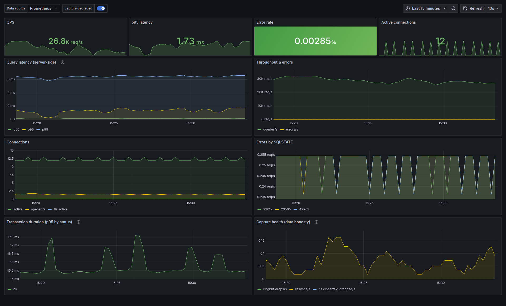

# latkit

**Per-query PostgreSQL and MySQL latency, per-route HTTP latency, per-operation S3 latency — without an extension, a config change, or a restart.**

Latkit is an eBPF agent that watches the PostgreSQL, MySQL/MariaDB, HTTP/1.x and
S3 wire protocols at the socket layer and turns them into latency histograms:
normalised query text, database/user labels, row counts, SQLSTATE errors and
transaction timings for the databases; templated routes, methods, hosts, status
codes and four separate timings for HTTP; operations, buckets, access keys, S3
error codes and object sizes for an object store. It exports to Prometheus and
OpenTelemetry, ships with six ready-made Grafana dashboards, runs beside the
server, and the server never knows it's there.

Every series carries a `proto="pg"|"mysql"|"http"|"s3"` label; one agent can
watch a 5432, a 3306, an 8080 and a 9000 at once
(`--port 5432,3306=mysql,8080=http,9000=s3`).

For HTTP that means p99 per route from a web server with no access log, no
status module and no instrumentation — and, when the caller sends a W3C
`traceparent`, a server span **inside the caller's existing trace**. For **S3**
it means p99 per operation, per bucket and per access key from a MinIO nobody
gave you the admin credentials to — with the object key, the most sensitive
thing an S3 request carries, never becoming a label. The declared blind zones
(HTTP/2 and therefore gRPC, HTTP/3, WebSocket — which is what MinIO's
inter-node grid rides on — and CONNECT) are counted rather than guessed at: see
[Known limitations](#known-limitations).




## Try the demo (≈2 minutes)

One command brings up the whole stack: PostgreSQL + a load generator + latkit +
Prometheus + Grafana with every dashboard provisioned. All you need is a
Linux host with Docker and a BTF-enabled kernel ≥ 5.15 (any mainstream distro
of the last few years):

```sh
git clone --recurse-submodules https://github.com/sky-rzn/latkit.git
cd latkit/deploy/demo
docker compose up --build -d
```

Open <http://localhost:3000/dashboards> and start with **latkit - Overview**;
live query latency shows up within a minute. TLS profile and troubleshooting:
[deploy/demo/README.md](deploy/demo/README.md). For MySQL, the same stack with
`mysql:8.4` and `proto="mysql"` dashboards lives in
[deploy/demo-mysql](deploy/demo-mysql/README.md); for **HTTP** — nginx in front
of a Go backend, the **latkit — HTTP** dashboard, plus optional HTTPS and
`traceparent`-into-Jaeger profiles — in
[deploy/demo-http](deploy/demo-http/README.md); for **S3** — MinIO driven by its
own `mc` client through every operation family, the **latkit — S3 / MinIO**
dashboard and an HTTPS profile — in
[deploy/demo-minio](deploy/demo-minio/README.md).

## Why latkit

- **Zero-touch.** You don't need a PostgreSQL extension,
  `shared_preload_libraries` or a restart — nor, for a web server, an access
  log, a status module or a line of instrumentation — nor, for an object store,
  admin credentials, a bucket-metrics level or `mc admin config set`. Point the
  agent at a running server and metrics start flowing. Nothing runs inside it;
  it doesn't know the agent exists.
- **Server-side truth.** Latency is measured network-to-network on the server's
  own host. It's what the server actually took, per query, including everything
  `pg_stat_statements` never sees (parse, protocol round-trips, result
  streaming) — and, for HTTP, including the time an application never sees at
  all: reading the request body off the socket and draining the response into
  it. See [the measurement model](#what-the-numbers-mean).
- **Bounded cardinality by construction.** SQL is normalised to a fingerprint
  (literals → `?`), a top-K LRU caps the distinct `query` labels, and the rest
  folds into `query="other"`. A URL is unbounded by construction, so the same
  machinery caps the HTTP `route` label — and the templater that turns
  `/users/8213/orders` into `/users/{id}/orders` only decides *which* routes you
  get, never *how many*. An S3 request needs no heuristic at all: its identity
  is an **operation** from a table of ~45. See
  [Routes](#http-routes-a-url-is-not-a-label) and
  [S3](#s3-an-operation-is-not-an-object-key).
- **Honest under loss.** Ringbuf drops and parser resyncs are counted and
  dashboarded.
- **TLS without decryption keys.** Encrypted sessions ride the same pipeline
  via `libssl` uprobes — and Go servers (Caddy, Traefik, any `net/http`)
  through `crypto/tls` probes, stripped binaries included. You don't need to
  pass private keys.
- **Part of the trace you already have.** An HTTP request carrying a W3C
  `traceparent` becomes a server span inside *that* trace
  ([details](#traceparent-inside-somebody-elses-trace)).
- **Drops in anywhere.** One static binary (musl, ~4 MB), Docker image,
  systemd unit or k8s DaemonSet.

## Installation

You can install latkit using one of the following methods.

### Release binary

Grab the tarball from the GitHub Releases page (statically linked, x86_64;
runs on any distro - the only dependency is the kernel, see
[Requirements](#requirements)):

```sh
sha256sum -c SHA256SUMS                # both files come with the release
tar xf latkit-vX.Y.Z-linux-x86_64.tar.gz && cd latkit-vX.Y.Z-linux-x86_64
sudo ./latkit                          # captures local port 5432
curl -s localhost:9752/metrics | head
```

The tarball also carries the Grafana dashboards, the systemd unit and the
k8s DaemonSet from this repository.

### Docker

The image is `FROM scratch` + the static binary (≈4 MB), published to
ghcr.io on releases (`ghcr.io/sky-rzn/latkit:vX.Y.Z`, `:latest`), or built
locally: `docker build -f deploy/docker/Dockerfile -t latkit .`

```sh
docker run -d --pid=host \
    --cap-add BPF --cap-add PERFMON \
    -e LATKIT_PROM_LISTEN=0.0.0.0:9752 -p 9752:9752 latkit
```

For TLS capture add `-e LATKIT_TLS=auto --cap-add SYS_PTRACE --cap-add
SYS_ADMIN` (see [Requirements](#requirements) for why). `--privileged` is
the documented fallback when a runtime or LSM cannot express the
fine-grained set - diagnosis recipes in [docs/deploy.md](docs/deploy.md).

### systemd

```sh
sudo apt install cmake clang libelf-dev
cmake -B build && cmake --build build -j"$(nproc)"
sudo cmake --install build                                        # /usr/local/bin/latkit
sudo mkdir -p /etc/latkit
sudo cp deploy/systemd/latkit.env.example /etc/latkit/latkit.env  # then edit
sudo cp deploy/systemd/latkit.service /etc/systemd/system/
sudo systemctl daemon-reload && sudo systemctl enable --now latkit
```

The unit runs sandboxed (`ProtectSystem=strict`, `NoNewPrivileges`, a
capability bounding set instead of full root); `/etc/latkit/latkit.env` is
the only configuration surface - every `LATKIT_*` variable is documented in
[the example file](deploy/systemd/latkit.env.example).

### Kubernetes

A single-file DaemonSet:

```sh
kubectl apply -f deploy/k8s/latkit-daemonset.yaml
```

`hostPID: true` + the capability set, `/healthz` probes, Prometheus scrape
annotations, and a `LATKIT_CGROUP` glob to tell apart several postgres pods
sharing port 5432 on one node. Kubepods glob patterns per cgroup driver are
tabulated in [docs/deploy.md](docs/deploy.md).

### From source

```sh
sudo apt install cmake clang libelf-dev
git submodule update --init            # bundled libbpf
cmake -B build
cmake --build build -j"$(nproc)"
ctest --test-dir build                 # unit tests, no root needed
```

Needs clang (BPF target), CMake ≥ 3.16, `bpftool`, `libelf`, `zlib`.
`-DLATKIT_SYSTEM_LIBBPF=ON` links a system libbpf ≥ 1.0 instead of the
submodule; `-DLATKIT_VMLINUX_H=` builds on a host without BTF. The release
binary is built differently (fully static musl, in a container):
[docs/deploy.md](docs/deploy.md).

## Requirements

- **Linux kernel 5.15+ with BTF** (`/sys/kernel/btf/vmlinux`). The hard
  floors underneath: BPF ringbuf (5.8), `bpf_get_socket_cookie` in tracing
  programs and BPF atomics (5.12), fentry/`tp_btf` trampolines. **5.15+ is
  the supported floor - it is what the CI kernel matrix boots and asserts
  (5.15, 6.1, 6.8, current stable; plaintext + TLS), so anything below is
  neither tested nor promised.** Without BTF the agent refuses at startup
  with a message naming the missing piece. Full version-by-version support:
  [docs/deploy.md](docs/deploy.md#kernel-support).
- **x86_64** arm64 is untested.
- **cgroup v2** if you use `--cgroup`.
- **Dynamically linked OpenSSL** in the observed server processes for TLS
  capture (`--tls auto`) — or, for a **Go** server, the binary named with
  `--tls-go`. MariaDB builds that link a bundled **wolfSSL/GnuTLS** instead of
  OpenSSL have no `libssl.so` to attach to — their TLS is detected and
  dropped-and-counted, not decrypted. Everything else is detected and counted
  without decryption. See [Known limitations](#known-limitations).
- **Privileges** - root, or the capability set below (kernel/LSM caveats and
  failure signatures in [docs/deploy.md](docs/deploy.md)):

| Capture | Capabilities | Why |
|---|---|---|
| plaintext | `CAP_BPF` + `CAP_PERFMON` | BPF programs/maps; loading tracing programs |
| TLS (`--tls auto`) | + `CAP_SYS_PTRACE` + `CAP_SYS_ADMIN` | reading `/proc/<pid>/(maps\|root)` of the server processes to find libssl; the kernel demands full `CAP_SYS_ADMIN` to create **u**probes |
| TLS (`--tls-go PATH`) | + `CAP_SYS_ADMIN` | uprobes again; no `/proc` scan is involved — the binary is named, so `CAP_SYS_PTRACE` and `hostPID` are not needed for this channel |

TLS capture in a container additionally needs **`hostPID`** (the libssl
autodetect walks `/proc/<pid>` of the observed server's processes). `hostNetwork`
is never needed: fentry capture sees every netns of the host by construction.

## Configuration

Flags and environment only. Every flag has a `LATKIT_<UPPER_SNAKE>`
equivalent; precedence is **flag > `LATKIT_*` env >
standard `OTEL_*` env (OTLP group only) > default**. Booleans take
`1`/`true`/`yes`/`on`. Repeatable flags map to one comma-separated variable
(`LATKIT_PORT=5432,5433`, `LATKIT_OTLP_HEADERS="k1=v1,k2=v2"`).
`latkit --print-config` prints the resolved result without touching BPF.
Use it to verify a deployment's env layer.

**Capture filters** (all active filters combine with AND):

| Flag | Env | Default | Meaning |
|---|---|---|---|
| `-p, --port PORT[=pg\|mysql\|http\|s3\|redis[:BYTES]]` | `LATKIT_PORT` | `5432` | local (server) port to capture, optionally with its wire protocol (default: `pg`) and a per-port capture budget; repeatable, up to 16 (e.g. `5432,3306=mysql,8080=http`, `9000=s3`, `6379=redis`, `443=http:4096`). `s3` is HTTP/1.1 read as the S3 API — same framer, same timings, operations and buckets instead of routes and hosts. `redis` is RESP2/RESP3, and covers Valkey, KeyDB, Dragonfly and Sentinel, which speak the same wire. The budget defaults to `--capture-limit` for a database port, **2048 for an `http` or `s3` one** — only heads are parsed, so a gigabyte of response body is never copied — and **512 for a `redis` one**, where a command is a verb and a key and the value is never read |
| `--comm NAME` | `LATKIT_COMM` | off | only capture send/recv of threads with this comm; a trailing `*` matches a prefix (`io_thd_*`). It matches the **thread** name, and servers rename their threads: **MySQL 8.x calls its per-session threads `connection`, not `mysqld`**, and a Redis with `io-threads N` does most of its socket work on `io_thd_1…N` (a filter of `redis-server` alone saw 28 % of the traffic on a 100-connection load). The port filter already scopes capture, so the usual answer is not to set this at all |
| `--cgroup PATTERN` | `LATKIT_CGROUP` | off | only capture cgroups whose path under `/sys/fs/cgroup` matches this glob (`*` stays within a path segment, `**` spans); repeatable, re-resolved every 30 s; requires cgroup v2 |

**Capture tuning**:

| Flag | Env | Default | Meaning |
|---|---|---|---|
| `--ringbuf-bytes N` | `LATKIT_RINGBUF_BYTES` | 8 MiB | ringbuf size, power of two; grow when `latkit_ringbuf_dropped_total` is non-zero at peak |
| `--capture-limit N` | `LATKIT_CAPTURE_LIMIT` | `8192` | capture budget in bytes per send/recv call; `total_len` accounting stays honest past it |
| `--max-conns N` | `LATKIT_MAX_CONNS` | `65536` | connection table ceiling; least recently active entry is evicted past it |
| `--conn-idle-timeout SEC` | `LATKIT_CONN_IDLE_TIMEOUT` | `600` | evict connections with no events for this long |

**Metrics shaping**:

| Flag | Env | Default | Meaning |
|---|---|---|---|
| `--top-queries N` | `LATKIT_TOP_QUERIES` | `500` | distinct normalised queries tracked before the rest fold into `query="other"` - the main cardinality knob |
| `--query-label-len N` | `LATKIT_QUERY_LABEL_LEN` | `256` | max chars of the normalised text kept as the `query` label |
| `--first-row-hist` | `LATKIT_FIRST_ROW_HIST` | off | also record `latkit_query_first_row_seconds` (doubles the query-labelled series) |

**HTTP observation** (only meaningful with an `=http` port; all optional — route
templating works with no configuration at all):

| Flag | Env | Default | Meaning |
|---|---|---|---|
| `--http-routes FILE` | `LATKIT_HTTP_ROUTES` | off | explicit route map, one `METHOD /users/{id}/orders` per line, first match wins; unmatched paths still fall through to the templater. [Format](deploy/demo-http/routes.map) |
| `--http-route-depth N` | `LATKIT_HTTP_ROUTE_DEPTH` | `8` | path segments kept in a route label; deeper paths end in `/…` |
| `--http-query-keys K[,K…]` | `LATKIT_HTTP_QUERY_KEYS` | none | query keys whose *value* belongs to the route (`?action=…` APIs). Every other key and value is dropped before the label |
| `--http-route-header NAME` | `LATKIT_HTTP_ROUTE_HEADER` | off | trust a route the application sends in this header. Off by default: it is client-controllable input, and only top-K bounds it |
| `--http-user basic\|none` | `LATKIT_HTTP_USER` | `none` | derive the `user` label from the name half of `Authorization: Basic`; the password is never decoded, Bearer tokens never touched |
| `--http-redact on\|off` | `LATKIT_HTTP_REDACT` | **on** | replace credential-looking query values (`token`, `sig`, `password`, `key`, `code`, …) with `***` wherever a request target leaves the handler — spans included |
| `--s3-domain NAME` | `LATKIT_S3_DOMAIN` | none | on an `s3` port, a Host of the form `<bucket>.NAME` is virtual-host addressing and the bucket comes from the Host; repeatable. Without it every request is read path-style, which is also what MinIO does without `MINIO_DOMAIN` |
| `--s3-user accesskey\|off` | `LATKIT_S3_USER` | `accesskey` | derive the `user` label from the access key in an S3 signature — the public half of the pair. The signature, the chunk signatures and `X-Amz-Security-Token` are never read; the object key is never a label at all |
| `--redis-user acl\|off` | `LATKIT_REDIS_USER` | `acl` | on a `redis` port, derive the `user` label from the ACL user of `AUTH <user> <pass>` / `HELLO … AUTH`. The password is a separate array element and is never read — and never shown: `--messages --hexdump` blanks it. Keys, values and arguments are never labels at any setting |

**Exporters** (both run independently; the OTLP group falls back to the
standard `OTEL_*` variables, so an agent deployed beside other OTel tooling
inherits the ambient config):

| Flag | Env | Default | Meaning |
|---|---|---|---|
| `--prom-listen ADDR:PORT\|none` | `LATKIT_PROM_LISTEN` | `127.0.0.1:9752` | serve `/metrics` + `/healthz`; `none` disables. Loopback by default - bind `0.0.0.0` to scrape from outside the host |
| `--otlp-endpoint URL` | `LATKIT_OTLP_ENDPOINT` | off | push OTLP/HTTP metrics to this Collector base URL (`http://` only); setting it **enables** the exporter. Falls back to `$OTEL_EXPORTER_OTLP_ENDPOINT` |
| `--otlp-interval SEC` | `LATKIT_OTLP_INTERVAL` | `15` | OTLP export period |
| `--otlp-header K=V` | `LATKIT_OTLP_HEADERS` | - | repeatable OTLP request header (auth for managed backends); falls back to `$OTEL_EXPORTER_OTLP_HEADERS` |
| `--otlp-resource K=V` | `LATKIT_OTLP_RESOURCE` | - | repeatable OTLP resource attribute; falls back to `$OTEL_RESOURCE_ATTRIBUTES` |
| - | `LATKIT_OTLP_SERVICE_NAME` | `latkit` | `service.name` in the OTLP resource; falls back to `$OTEL_SERVICE_NAME` |
| `--otlp-spans RATIO` | `LATKIT_OTLP_SPANS` | off | sample this fraction `[0,1]` of queries as spans (**raw SQL leaves the host** - see [Security](#security)); needs `--otlp-endpoint` |
| `--otlp-spans-slow-ms N` | `LATKIT_OTLP_SPANS_SLOW_MS` | off | also sample every query at least N ms long |
| `--otlp-span-text-max N` | `LATKIT_OTLP_SPAN_TEXT_MAX` | `4096` | cap `db.query.text` at N bytes |
| `--otlp-span-masked` | `LATKIT_OTLP_SPAN_MASKED` | off | send the normalised (literal-free) SQL as `db.query.text` instead of the raw text |

**TLS capture** ([stage 6](STAGE6.md); requirements above):

| Flag | Env | Default | Meaning |
|---|---|---|---|
| `--tls auto\|off` | `LATKIT_TLS` | `off` | capture TLS plaintext via `libssl` uprobes; `auto` scans `/proc` for the matching processes' libssl and rescans every 30 s for new ones. That comm set gates the uprobe channel only (a shared-libssl uprobe fires for every process mapping the library) — plaintext capture on the configured ports is unaffected by it |
| `--libssl PATH` | `LATKIT_LIBSSL` | off | attach the `SSL_*` uprobes to this exact libssl, skipping the scan (e.g. a container's copy); a missing file is fatal |
| `--tls-comm NAME` | `LATKIT_TLS_COMM` | derived from `--port` | with `--tls auto`, scan only processes with this exact comm. The default set follows the configured protocols: `postgres`, `mysqld`, `mariadbd` for a database port, `nginx`, `httpd`, `apache2`, `haproxy` for an HTTP one, `minio` for an `s3` one, `redis-server`, `valkey-server`, `keydb-server` for a `redis` one. `--print-config` prints the derived scan set as `tls_scan_comm` and the uprobe gate — the same set plus the servers' own thread names, `connection` for MySQL 8.x and `io_thd_*` for a Redis with `io-threads` — as `tls_gate_comm` |
| `--tls-go PATH` | `LATKIT_TLS_GO` | off | capture the TLS plaintext of a **Go** server (Caddy, Traefik, MinIO, any `net/http`) by probing `crypto/tls` inside this binary — there is no libssl to scan for. Works on stripped binaries (the ones distributions ship) through Go's own function table. Repeatable, up to 4; x86-64; a binary that cannot be hooked is fatal at startup, with the cause and a way forward. **An `s3` port has no other TLS channel** — MinIO maps no libssl. [docs/notes-tls.md](docs/notes-tls.md) §4b |

**Debug / diagnostics** (off by default; noisy, not for production):

| Flag | Env | Default | Meaning |
|---|---|---|---|
| `--record FILE` | `LATKIT_RECORD` | off | append every raw ringbuf record to FILE for offline replay (LKT1 trace, drives the test fixtures) |
| `--events` | `LATKIT_EVENTS` | off | print one line per raw ringbuf event |
| `--messages` | `LATKIT_MESSAGES` | off | print one line per reassembled protocol message |
| `--queries` | `LATKIT_QUERIES` | off | print one line per session and per query observation (debug tee before the aggregator) |
| `-x, --hexdump` | `LATKIT_HEXDUMP` | off | dump event payload (`--events`) and the captured body prefix (`--messages`) |
| `--dump-metrics[=FILE]` | `LATKIT_DUMP_METRICS` | off | write the Prometheus exposition on `SIGUSR1` and at exit, to FILE (default: stderr) |
| `--cap-headers` | `LATKIT_CAP_HEADERS` | off | test hook: switch every connection to HEADERS capture mode (64 B/call) at OPEN |
| `--print-config` | - | - | resolve config (flag > env > default) to stdout and exit; no BPF |
| `--version` | - | - | print the agent version and exit |
| `-h, --help` | - | - | print the flag reference and exit |

## What the numbers mean

latkit measures **server-side, network-to-network** time: from the query's
arrival at the server's TCP socket to the completion of the reply - at
syscall granularity (`bpf_ktime_get_ns` per `send`/`recv` call; messages
packed into one syscall share a timestamp). For a simple query that is
`Query` → `CommandComplete`. For the extended protocol, `Bind`/`Execute` →
its completion, with pipelined batches attributed per execution unit rather
than per shared `ReadyForQuery`. Time to first row
(`latkit_query_first_row_seconds`, opt-in) and transaction spans
(`latkit_txn_duration_seconds`) come from the same stream.

This is deliberately **not** the same number as `pg_stat_statements.
mean_exec_time`, which times only the executor: latkit's span additionally
contains parse/plan protocol handling, result serialisation and streaming,
and the kernel socket path on the server side - i.e. what the *client*
experiences minus the network RTT and the client itself.

Honesty guarantees, every ringbuf drop is counted twice (globally and
per-connection), a query observation that spans a loss is discarded and counted
(`latkit_queries_dropped_total{reason}`), parser resyncs are metrics, and
the Overview dashboard pins a "capture degraded" annotation to any window
with non-zero drops.

**For HTTP the one interval becomes four**, because a `POST` of a gigabyte over
a slow link is not a slow server:

```
ts_start ──request head + body──▶ ts_req_done ──server──▶ first byte ──▶ ts_complete
          └ latkit_http_request_upload_seconds ┘└ ttfb ┘
                                               └────── duration ───────┘
```

`latkit_http_request_duration_seconds` starts at the **end of the request**, so
the client's upload time is reported as its own family instead of being charged
to the server; `latkit_http_ttfb_seconds` splits "thinking" from "streaming".
This differs from nginx's `$request_time`, which covers the whole span — the two
are reconciled, with numbers, in [docs/accuracy.md](docs/accuracy.md). A 5xx is
an error; a **4xx is not** (the server correctly saying no), though both are
counted by exact code in `latkit_http_errors_total`.

An **S3** port uses that same model — an object store is where it matters most,
since a `PUT` of a gigabyte and a `GET` that streams one are exactly the shapes
a single duration histogram destroys. Measured against MinIO's own
`mc admin trace`, the split is exact to a fraction of a millisecond
([docs/accuracy.md](docs/accuracy.md) §S3).

## HTTP routes: a URL is not a label

A `query` label is bounded because SQL normalises to a fingerprint. A URL has no
such property — `/users/8213/orders` is a different string for every user — so
the `route` label is built in three layers, and the guarantee comes from the
third, not from the heuristic:

1. **an explicit map** — `--http-routes FILE`, one `GET /users/{id}/orders` per
   line, first match wins. For the teams who already know their OTel
   `http.route`;
2. **templating** (the default, no configuration): each path segment is
   classified — plain number, UUID, ULID, hex digest ≥ 8, `YYYY-MM-DD`, longer
   than 24 characters, over 40 % digits, base64-ish — and anything that looks
   like a value becomes `{id}`. A file extension is kept (`{file}.js`), depth is
   capped (`--http-route-depth`), and the **query string is dropped entirely**
   unless you name keys with `--http-query-keys`;
3. **a hard bound**: the same top-K dictionary the `query` label uses. Whatever
   the first two layers decide, a route that does not fit folds into
   `route="other"` — so a heuristic that fails on your API costs accuracy, never
   cardinality, and the `route="other"` share is a headline panel telling you
   exactly that.

The route's identity includes the method: `GET /orders/{id}` and
`DELETE /orders/{id}` are two routes, never one histogram.

## S3: an operation is not an object key

`--port 9000=s3` reads the same HTTP/1.1 wire under the object store's nouns.
Nothing about the framing, the timings or the TLS channel changes; four things
about the *meaning* do:

- **the identity of a request is an operation, from a table.** `GetObject`,
  `UploadPart`, `ListObjectsV2`, `DeleteObjects`, `CreateMultipartUpload`, …
  — derived from (method, path shape, query keys), about 45 values, listed in
  [docs/notes-s3proto.md](docs/notes-s3proto.md). There is no templating
  heuristic here and none is wanted: cardinality is bounded by the table itself,
  an unknown call is `op="other"`, and **the object key never becomes a label**
  — not truncated, not hashed, not templated. It is the most sensitive part of
  an S3 request, and the guarantee about it is structural;
- **the bucket takes the `host` slot**, read path-style (`/bucket/key`) or from
  the Host with `--s3-domain`, and only after it passes S3's own naming rules —
  a name arrives from the wire, so it becomes a label after a check, not before.
  A request that names no bucket (`ListBuckets`) is `bucket="-"`, which is a
  different fact from a name that was refused (`bucket="other"`);
- **the access key becomes `user`** — the public half of the pair, out of the
  SigV4 `Credential=` or a presigned `X-Amz-Credential`. The signature, the
  per-chunk signatures and `X-Amz-Security-Token` are never read; an anonymous
  request is `user="-"`. Since STS credentials are ephemeral, the (bucket,user)
  ceiling is raised automatically for an `s3` port and spills to `user="other"`;
  `--s3-user off` drops the label;
- **an error has a name, not just a number.** At status ≥ 400 the agent reads
  the `<Code>` element from the start of the response body — the one case where
  any body byte is looked at — so `NoSuchKey`, `NoSuchBucket` and
  `AccessDenied` are told apart instead of being three `404`/`403`s. Object
  sizes come from `x-amz-decoded-content-length` when the upload is
  `aws-chunked`, so the histogram measures objects rather than chunk framing.

**MinIO already exports Prometheus metrics** — including API latencies — so the
honest case for this is what those do not have: zero touch (no admin
credentials, no bucket-metric level, no restart), the **access key and the
bucket in one cut**, TTFB and body-streaming time kept apart, the individual
slow request as a span, one agent per host for the databases, the web servers
and the object store, and the same labels on any S3-compatible server, MinIO's
own metrics endpoint or none at all. It does not replace heal state, drive
health, capacity or replication lag: run both.

Not the S3 API, and counted as such: MinIO's `/minio/…` surface — health
probes, the admin API, the metrics endpoint — lands in
`latkit_s3_internal_requests_total` and in nothing that says "requests" (on a
distributed pool it is most of the port's traffic), and the inter-node **grid**
is a binary protocol inside a websocket, which is a declared blind zone.

## Redis: a command is not a key

`--port 6379=redis` reads RESP2/RESP3 — Redis, Valkey, KeyDB, Dragonfly and
Sentinel are the same wire. Three things about a cache differ from everything
above, and each one is a number that would be wrong if it were reported the
obvious way:

- **the identity is a command, from a closed table** — `GET`, `XADD`, and for a
  container command its subcommand too: `CONFIG|GET`, `XINFO|STREAM`. About 250
  values, listed in [docs/notes-redisproto.md](docs/notes-redisproto.md), so
  cardinality is a compile-time constant and an unknown command is `cmd="other"`.
  **Keys, values and arguments never become labels**, at any setting: the second
  element of a non-container command is a key, and it is not read;
- **the labels are connection state.** `db` is the `SELECT`ed database number
  and `user` the ACL user from `AUTH <user> <pass>` / `HELLO … AUTH` — both
  tracked per connection, and both moved only when the *server* accepts the
  command (`SELECT 16` is an error and changes nothing). The password is a
  separate array element, never read and never shown: `--messages --hexdump`
  blanks it. A connection the agent joined mid-stream reports `db="?"` rather
  than a `0` it would be guessing;
- **three kinds of duration, three families.**
  `latkit_redis_command_duration_seconds` is the server's work.
  `latkit_redis_blocking_seconds` is `BLPOP key 30` — the timeout the *client*
  chose, which in the general histogram would be the p99 of the whole instance.
  A command answered `+QUEUED` inside a `MULTI` has no duration at all: it is
  counted, and the interval that means something — `MULTI` to the reply to
  `EXEC` — goes to `latkit_txn_duration_seconds`, the same family PostgreSQL
  uses. Cluster `-MOVED`/`-ASK` are counted as redirects and not as errors, or a
  resharding cluster reads as an outage.

**Redis has `INFO commandstats`**, and it is good, so the honest case is what it
cannot do: it reports a *mean* per command and nothing about the tail, and it
measures execution inside the server. latkit measures network-to-network on the
server's host, so it includes the wait behind somebody else's slow command in
the single-threaded event loop — which is what the application feels and what
`commandstats` structurally cannot see (one `KEYS *` delays everyone, and
`GET` still reports as fast). It also splits by database *and* ACL user at once
where `INFO` is global for the instance, needs no credentials and no
`CONFIG SET`, and gives you the individual slow command as a span. `PING` is
kept as an ordinary command with its own latency and its own dashboard panel: it
does no work, so its p99 is the event loop's queueing delay.

**A `tls-port` Redis needs `--tls auto` and nothing else.** Every Redis, Valkey
and KeyDB build we measured — Alpine images included — links OpenSSL
dynamically, so the existing libssl channel carries the plaintext and an
encrypted run reports what an unencrypted one reports, command for command. Two
things follow from Redis' own thread model and are handled for you: with
`io-threads N` the server does its reads and writes on threads called
`io_thd_1…N`, which the uprobe gate admits by prefix (an operator's `--comm
redis-server` would not — see the flag), and a connection that was already open
when the agent started is adopted on its first decrypted byte rather than read
as ciphertext for the life of the pool.

Blind by design: the **unix socket** — check with `redis-cli config get
unixsocket`, and if that is how your application connects, this agent sees
nothing at all — the cluster bus, replication and `MONITOR` connections (both
counted in `latkit_ignored_conns_total{reason}`), and the contents of values.

## `traceparent`: inside somebody else's trace

If a request carries a W3C `traceparent`, the sampled span latkit exports takes
**that** trace id and the caller's span id as its parent (and passes
`tracestate` through). The agent's view of the request then appears inside your
existing distributed trace — a `SPAN_KIND_SERVER` span with the OTel HTTP
semantic conventions (`http.request.method`, `http.route`,
`http.response.status_code`, `server.address`, `url.scheme`, `url.path`,
`network.protocol.version`, `user_agent.original`, `client.address`) — with
nothing instrumented inside the server. Requests without a `traceparent` get a
trace of their own, as before.

Sampling becomes parent-based for such requests: a sampled trace is always
exported, an unsampled one is skipped by `--otlp-spans` but can still be picked
up by `--otlp-spans-slow-ms` (deliberate: a slow request is worth a span even
when its trace was not sampled). Spans are off until you set `--otlp-endpoint`,
and a span is the only path by which a `url.path` — redacted — leaves the host.
Try it: the `trace` profile of [deploy/demo-http](deploy/demo-http/README.md).

## Overhead

Measured with paired ABAB runs against a no-agent baseline at ~50k
queries/s (pgbench select-only `-c 128` and TPC-B `-c 100`), counting only
runs with **zero** capture loss ([docs/perf.md](docs/perf.md) has the full
method, tables and reproduction script - `tests/bench/run.sh`):

- **Workload impact: none measurable.** ΔTPS vs baseline is within ±0.2%
  for plaintext, TLS and OTLP-export configurations.
- **Agent CPU**: 0.31 cores per 50k queries/s plaintext, 0.45 with TLS.
  RSS ~25 MiB under load.
- **TLS uprobe tax**: with `--tls`, the *observed postgres* pays
  ~25 µs CPU per query for the `SSL_*` uprobes.
- Past the budget (this stand saturates the single pipeline thread at
  ~150–200k queries/s per core) the agent **drops and counts** rather
  than degrading silently.

For an object store the cost tracks bytes and calls rather than a query rate,
and `warp` measures it: **0.010 cores** at 400 operations/s and 240 MiB/s
against one MinIO, **0.160** for the same client load against a four-node pool
— because 65 % of what arrives on a pool's S3 port is the cluster talking to
itself. Uncapped, one node delivers 880 MiB/s (7.4 Gbit/s) with **zero** dropped
records at the default 2048-byte per-call capture budget.

## Security

- **The agent sees SQL text; masking is on by default and by construction.**
  Normalisation turns every literal into `?` before text can reach a metric
  label. Raw SQL never enters the metrics registry. This holds for TLS
  sessions identically - with `--tls`, latkit reads decrypted buffers from
  `libssl`, so wire encryption is not a privacy boundary against an agent
  on the DB host.
- **Raw SQL leaves the agent only in OTel spans, which are off by default**
  (`--otlp-spans`). Enable them deliberately. `--otlp-span-masked`
  substitutes the normalised text where literals must not leave the host.
- **The agent sees whole HTTP requests; only the route template survives.**
  Raw paths, query strings, headers and bodies never enter the metrics
  registry — the label is the template, and that is structural, not a setting.
  Credential-looking query values (`token`, `sig`, `password`, `key`, `code`,
  …) are replaced by `***` wherever a target leaves the handler
  (`--http-redact`, on by default), credential headers are blanked even in the
  debug dump, and `Authorization` is decoded no further than a user name — and
  only if you ask for it (`--http-user basic`). A sampled span is the only
  thing that carries a `url.path` (redacted) off the host.
- **On an S3 port the object key is never a label**, by construction rather than
  by redaction: the label is the operation, and it comes from a table. From an
  S3 signature only the access key is read — never the signature itself, the
  per-chunk signatures or `X-Amz-Security-Token` — and `--s3-user off` removes
  even that. The one body the agent looks at is the first bytes of an *error*
  response, for its `<Code>` element.
- **On a Redis port not even a span carries an argument.** Where a PG span
  carries raw SQL, a Redis span's `db.query.text` is *built* from the identity
  and a `?` per argument — `GET ?`, `SET ? ? ? ?` — because a key is an
  identifier and a value is your data. There is no setting that turns it into
  the real command, `--otlp-span-masked` included, and the password of an `AUTH`
  is blanked even in the `--messages --hexdump` view.
- **Own endpoints bind loopback by default** (`--prom-listen
  127.0.0.1:9752`) and speak plain HTTP with no auth. Exposing them
  (`0.0.0.0`) is an explicit choice. Front with a reverse proxy outside a
  trusted scrape network. `--otlp-endpoint` is `http://` only - put TLS in
  front of a remote Collector.
- **`CAP_SYS_PTRACE` + `hostPID`** (TLS capture only) grant the agent read
  access to other processes' `/proc/<pid>` - that is precisely what the
  libssl autodetect needs and the reason the plaintext-only deployment can
  drop both.

## Known limitations

- **TLS: dynamically linked OpenSSL, plus Go's `crypto/tls`.** OpenSSL servers
  (postgres, mysqld/mariadbd, nginx, Apache, HAProxy, redis/valkey/keydb) are
  read through libssl
  uprobes; Go servers through `--tls-go`, stripped binaries included (x86-64 —
  see [docs/notes-tls.md](docs/notes-tls.md) §4b). A statically linked OpenSSL
  can be reached by pointing `--libssl` at the server binary itself. Everything
  else — GnuTLS/NSS, GSSENC (Kerberos encryption), an arm64 Go binary — is
  *detected* and its ciphertext dropped-and-counted (`latkit_tls_*` metrics),
  never guessed at. BoringSSL may work through the offset-independent bridge but
  is untested. [docs/notes-tls.md](docs/notes-tls.md) §6.
- **HTTP scope: HTTP/1.0 and HTTP/1.1, server side.** Keep-alive, pipelining,
  `chunked`, `Expect: 100-continue`, 1xx, absolute-form targets and every method
  are parsed. Out of scope, each *recognised and counted* rather than guessed
  at (`latkit_ignored_conns_total{reason}`):
  - **HTTP/2 — and therefore gRPC.** HPACK's header table cannot survive a
    capture hole and per-stream state cannot be bounded the way this agent
    bounds everything else; the preface is detected and the connection is
    dropped whole (`reason="h2"`). On a browser-facing TLS port ALPN picks h2
    almost always — capture the origin leg behind the terminator, which is
    still HTTP/1.1 by default. Reasoning in full: PLAN-HTTP.md §8;
  - **WebSocket and any `Upgrade`** (`reason="upgrade"`), **`CONNECT` tunnels**
    (`reason="connect"`) — after the switch the bytes are not HTTP;
  - **`sendfile` response bodies** may not cross the capture point: `bytes_out`
    is then a declared lower bound (the unit is flagged, and left out of the
    size histogram rather than skewing it). Since ~6.5 the kernel routes them
    through `sendmsg` and they are accounted normally;
  - **request bodies** are never parsed (JSON, forms, multipart), and neither
    are headers beyond the small list of interest.

  Outgoing requests (your app calling someone else's API) are not observed in
  v1: the capture filter is on the local port, and a client's local port is
  ephemeral.
- **S3 scope: the client-facing API of an S3 server over HTTP/1.x.** Everything
  the HTTP scope above says applies unchanged; on top of it, and out of scope on
  purpose:
  - **MinIO's inter-node traffic.** The **grid** multiplexer (`/minio/grid/…`)
    is binary msgp inside a websocket, so it leaves through the `Upgrade` door
    (`latkit_ignored_conns_total{reason="upgrade"}`); peer/storage/lock RPC and
    every other `/minio/…` request on the client port — health probes, the
    metrics endpoint, the **admin API**, which is never parsed — is counted in
    `latkit_s3_internal_requests_total` and becomes no observation. Capture the
    client port, one agent per node;
  - the **Console/WebUI** is a separate port and is not captured unless you name
    it;
  - **`S3 Select`** and other event-framed responses: the body is a frame
    stream, not an object — timings and status stay right, the payload is never
    parsed. Request bodies (XML policies, the key list of a `DeleteObjects`)
    are not parsed either;
  - **TLS is the Go channel or nothing** (`--tls-go`): MinIO maps no libssl.
    A binary that cannot be hooked is fatal at startup with the cause, rather
    than a flat dashboard — see [docs/notes-tls.md](docs/notes-tls.md) §4b;
  - a **`sendfile`/large-write response body** is where the one measured
    systematic difference lives: the tail of a body's last capture-budget hole
    is not credited, so `bytes_out` can be a declared lower bound
    (`LK_QO_BODY_UNSEEN`, never above the truth). Numbers:
    [docs/accuracy.md](docs/accuracy.md) §S3.
- **UDP is counted, never parsed.** QUIC/HTTP-3 does not pass through the TCP
  capture point at all, so an h3 server would look exactly like a broken agent.
  Datagrams on the captured ports are therefore counted
  (`latkit_udp_bytes_total{port,dir}`, `latkit_udp_packets_total`) and the agent
  says so in its log — the number that distinguishes "nothing to see" from
  "nothing we can see".
- **MySQL scope: classic protocol only.** The **X Protocol** (port 33060,
  protobuf) is a different protocol, out of scope. The **compressed protocol**
  (`CLIENT_COMPRESS`, zstd) and **replication** streams (`COM_BINLOG_DUMP`) are
  recognised and honestly counted as blind — the connection goes to a
  headers-only IGNORE with a reason, no partial parse. Query attributes,
  prepared statements, multi-statements, `LOAD DATA LOCAL` and multi-resultsets
  are parsed. [docs/notes-myproto.md](docs/notes-myproto.md).
- **Unix-domain sockets are invisible** (`tcp_*` hooks are not on that
  path). Planned v1.1 (`unix_stream_sendmsg/recvmsg` hooks).
- **`splice()`-relayed traffic** (e.g. docker-proxy on published ports)
  bypasses the capture point. Sends degrade to honest zero-payload events,
  receives are missed entirely. Irrelevant for the intended
  agent-on-the-DB-host deployment. Look for details in
  [docs/notes-iov.md](docs/notes-iov.md).
- **No TLS/auth on the agent's own endpoints** (`/metrics`, `/healthz`,
  OTLP client).
- **Prometheus exposition is classic `le`-buckets only.** For native
  histograms point the OTLP exporter at Prometheus's
  `otlp-write-receiver` (or a Collector). The agent's
  `ExponentialHistogram` lands as a native histogram losslessly.
- **cgroup filter requires cgroup v2**, and a pod recreated between
  re-resolve ticks loses its first ≤ 30 s of capture (glob re-resolve
  period). See [docs/deploy.md](docs/deploy.md).
- **x86_64 release artifacts only**.

## How it works

```
        kernel                             userspace (one process, one epoll loop)
┌───────────────────────────┐            ┌──────────────────────────────────────────┐
│ fentry tcp_sendmsg        │  ringbuf   │ conn table → framer → PG/MySQL/HTTP(+S3) │
│ fentry/fexit tcp_recvmsg  │ ─────────▶ │   parser → SQL normaliser / route        │
│ tp_btf inet_sock_set_state│  events    │   templater / S3 op table → top-K reg.   │
│ uprobes SSL_read/SSL_write│            │   → /metrics (pull) + OTLP push + spans  │
│ uprobes Go crypto/tls     │            │                                          │
│ fentry udp_sendmsg/recvmsg│            │ (UDP: counted only — see limitations)    │
└───────────────────────────┘            └──────────────────────────────────────────┘
```

The kernel side does the minimum: filter (port AND comm AND cgroup), stamp,
and ship raw payload chunks with per-connection sequencing. All protocol
intelligence lives in userspace, where a lost event is a countable gap
instead of a corrupted parse. TLS sessions ride the same pipeline - the
uprobes substitute plaintext for the socket ciphertext under the same
connection identity, and the socket-layer copy is dropped and counted. The
layer-by-layer write-ups: [docs/notes-iov.md](docs/notes-iov.md) (payload
capture), [docs/notes-reassembly.md](docs/notes-reassembly.md) (framing),
[docs/notes-pgproto.md](docs/notes-pgproto.md) /
[docs/notes-myproto.md](docs/notes-myproto.md) /
[docs/notes-httpproto.md](docs/notes-httpproto.md) /
[docs/notes-s3proto.md](docs/notes-s3proto.md) (parsers),
[docs/notes-metrics.md](docs/notes-metrics.md) (normalisation, nomenclature,
cardinality), [docs/notes-export.md](docs/notes-export.md) (exporters),
[docs/notes-tls.md](docs/notes-tls.md) (TLS).

The metric nomenclature is a public API:
`latkit_query_duration_seconds{proto,query,db,user,code}` histograms,
`latkit_queries_total`, `latkit_query_errors_total{sqlstate}`,
`latkit_query_rows_total`, connection/transaction series, and the agent
self-metrics (`latkit_ringbuf_dropped_total`, `latkit_resync_total`,
`latkit_metric_series`, …) that feed the **Agent health** dashboard.
HTTP reports through families of its own rather than borrowing the database
ones — `latkit_http_request_duration_seconds{route,method,host,user,proto,code}`,
`latkit_http_ttfb_seconds`, `latkit_http_request_upload_seconds`,
`latkit_http_requests_total{…,status}`, `latkit_http_errors_total{code,…}`,
`latkit_http_bytes_total{…,direction}`, `latkit_http_response_size_bytes` —
because a request has no rows, no SQLSTATE and no transaction. An S3 port reads
the same exchange under the object store's nouns:
`latkit_s3_request_duration_seconds{op,method,bucket,user,proto,code}`,
`latkit_s3_ttfb_seconds`, `latkit_s3_request_upload_seconds`,
`latkit_s3_requests_total{…,status}`, `latkit_s3_errors_total{s3code,…}` (the
symbolic code, because `NoSuchKey` and `NoSuchBucket` are both `404`),
`latkit_s3_bytes_total{…,direction}`, `latkit_s3_object_size_bytes` (the logical
object size, chunk framing discounted) and
`latkit_s3_internal_requests_total` (MinIO's own `/minio/…` surface, counted and
in nothing that says "requests"). A Redis port reports under the cache's:
`latkit_redis_command_duration_seconds{cmd,db,user,proto,code}`,
`latkit_redis_commands_total{…,code}`, `latkit_redis_errors_total{error,…}` (the
symbolic token — `WRONGTYPE`, `NOSCRIPT`, `OOM`),
`latkit_redis_redirects_total{kind}` (`-MOVED`/`-ASK`, which are not failures),
`latkit_redis_blocking_seconds` (the wait the client asked for, kept out of the
duration histogram), `latkit_redis_bytes_total{…,direction}`,
`latkit_redis_value_size_bytes`, `latkit_redis_pipeline_depth` and
`latkit_redis_push_total` — plus `latkit_txn_duration_seconds` unchanged, since
`MULTI`…`EXEC` is a transaction. One registry, four label profiles
([docs/notes-metrics.md](docs/notes-metrics.md)).
For a valid exposition use `latkit --dump-metrics` + `kill -USR1`.

## Development

Dev builds stay dynamic glibc (sanitizers don't mix with musl `-static`).
The dev stand is PostgreSQL 16 in Docker plus pgbench:

```sh
docker compose -f deploy/dev/docker-compose.yml up -d
sudo ./build/latkit --queries &
./deploy/dev/bench.sh -c 8 -T 15
```

`--events` / `--messages` / `--queries` print the pipeline's intermediate
streams one line at a time (`-x` adds hexdumps). `--record file.lkt` dumps
the raw event stream for offline replay through the same pipeline - that is
how the deterministic test fixtures work (`tests/replay/`,
`tests/e2e/verify.sh`, `verify-tls.sh`, `verify-mysql-tls.sh`,
`verify-http.sh`, `verify-s3.sh`, `verify-s3-tls.sh`, `verify-redis-tls.sh`).

## License

GPL-2.0 (see [LICENSE](LICENSE)). The BPF programs are GPL-licensed as the
kernel requires; vendored dependencies keep their own licenses
(`third_party/libbpf` - LGPL-2.1 OR BSD-2-Clause).
